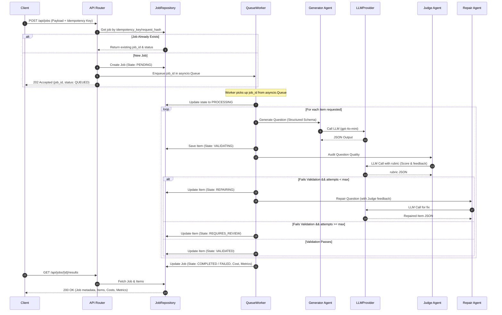
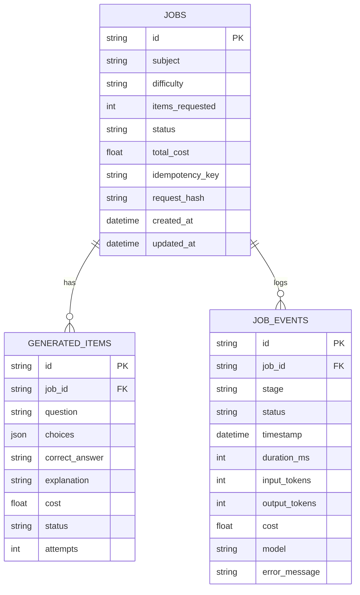

# Production-Grade Implementation Plan — Agentic Content Generation Service

## Scenario & Goal Description

Growtrics generates educational content at scale — questions, explanations, hints, and short learning sequences — for learners across mobile and web.

The first engineering constraint driving every design decision is **cost at scale**. We are targeting millions of content items for tens of dollars, not thousands. This means every architectural choice — model selection, prompt design, batching, caching, fallback — needs to treat cost-per-output as a first-class metric.

The second constraint is **reliability**. LLMs fail, hallucinate, and drift. At this scale, even a 2% failure rate means tens of thousands of broken content items in production. A robust pipeline must catch failure before it reaches learners — through validation, repair loops, quality gates, and graceful degradation.

**Our Task:** Build a backend prototype of an agentic content generation service that takes a subject + difficulty level, generates a set of educational questions with explanations, validates quality, and exposes the results through a clean, reliable, and observable API.

### Design Principles
- **Persist workflow state before invoking external side effects**: State transitions are written before external LLM calls so recovery can resume from a known checkpoint after failures.
- **Keep LLM interactions deterministic where possible**: Use structured outputs, low temperature settings, and explicit rubrics.
- **Fail closed rather than returning unvalidated content**: If repair attempts are exhausted, mark the item for manual review rather than returning unverified content.
- **Separate orchestration from provider implementations**: Isolate core agent pipelines from database drivers and provider client libraries.
- **Optimize for observability over hidden automation**: Log structured event trace logs for every execution step.

### What to Build
We will build a working backend prototype containing:
- **A FastAPI backend** serving the REST API.
- **An API endpoint** accepting a generation request: `subject`, `difficulty level`, and `number of items`.
- **An async multi-agent pipeline** that generates content, validates it, and repairs or filters low-quality output.
- **A visible job status** and a way to retrieve completed results via polling.
- **At least one LLM-as-judge quality gate** that rejects or triggers repair on bad output.
- **A clear cost accounting surface** where each generated item has a tracked cost and the job exposes total cost.
- **Content item schema requirements**: Each generated question must include:
  - Question text
  - Four answer choices
  - Correct answer identification
  - A short explanation

### Key Deliverables
- **Codebase with the FastAPI backend**: Clean, production-ready async FastAPI service in python.
- **`README.md`**: Operational guidelines including dependencies setup, run commands, API endpoints overview, and validation testing instructions.
- **`architecture_note.md`**: The design log addressing pipeline details, quality gates, cost calculations, and structural cuts.
- **Committed generated output for all three test cases**: Verification results committed in `/test_cases/`.

---

## Architecture Design Overview

We implement a **Clean Architecture** layout. This isolates core business logic (domain and application layers) from external concerns (FastAPI controllers, SQLite database, and specific LLM provider client SDKs).

### Proposed Directory Structure

```
.
├── app/
│   ├── api/                    # Delivery Layer: Routers, HTTP Schemas, and Controllers
│   │   ├── __init__.py
│   │   ├── routes.py           # Job submission, status polling, and retrieval
│   │   └── schemas.py          # Pydantic API schemas
│   ├── core/                   # System Configuration and Constants
│   │   ├── __init__.py
│   │   ├── config.py           # Settings: API keys, model parameters, pipelines
│   │   └── exceptions.py       # Custom system exceptions
│   ├── domain/                 # Business Entities & Interfaces (Pure Python)
│   │   ├── __init__.py
│   │   ├── entities.py         # Job, Item, and Event dataclasses/enums
│   │   └── interfaces.py       # Repository and LLMProvider abstract base classes
│   ├── application/            # Orchestration & Use Case Coordinates
│   │   ├── __init__.py
│   │   ├── orchestrator.py     # Execution pipeline coordinating agents
│   │   └── state_machine.py    # Transition rules for Jobs and Items
│   ├── providers/              # External Integrations (Gateway Implementations)
│   │   ├── __init__.py
│   │   ├── llm/
│   │   │   ├── base.py         # LLM base connector with retry logic
│   │   │   ├── openai.py       # OpenAI client implementation
│   │   │   ├── gemini.py       # Gemini client implementation
│   │   │   └── anthropic.py    # Anthropic client implementation
│   │   └── pricing/
│   │       └── calculator.py   # Fine-grained token cost calculation
│   ├── repositories/           # Persistence Gateways
│   │   ├── __init__.py
│   │   ├── database.py         # SQLite connection pooling & async sessions
│   │   ├── job_repo.py         # SQLite repository for jobs
│   │   └── item_repo.py        # SQLite repository for items
│   ├── workers/                # Queue Workers
│   │   ├── __init__.py
│   │   └── queue_worker.py     # asyncio.Queue runner for handling jobs
│   └── telemetry/              # System Tracing and Metrics Collection
│       ├── __init__.py
│       ├── logger.py           # Structured JSON logger
│       └── metrics.py          # Metric aggregators (latencies, fail rates)
├── prompts/                    # Externalized Prompt Versioning
│   ├── generator_v1.txt
│   ├── judge_v1.txt
│   └── repair_v1.txt
├── test_cases/                 # Output directories for required evaluations
├── requirements.txt            # System dependencies
├── README.md                   # Operational Setup and API Manual
└── architecture_note.md        # Technical design, trade-offs, and cost models
```

---

## 1. Request Lifecycle Sequence



---

## 2. Technical System Specifications

### 2.1 SQLite Persistence & asyncio.Queue Scheduling
Instead of FastAPI's in-memory `BackgroundTasks` (which can lose state upon crash and does not support durable execution constraints), we implement a durable Producer-Consumer pattern:
- **Durable Persistence**: SQLite database acts as our source of truth, persisting the job and item state changes at every transition.
- **Self-Contained Queue**: `asyncio.Queue` serves as our local, in-memory execution scheduler.
- **Why SQLite?**: Selected because the challenge requires a lightweight, self-contained prototype. The repository pattern abstracts database interactions, allowing seamless migration to production databases without modifying application logic.
- **Why not Redis?**: Redis-backed distributed queues (such as Celery, RQ, or ARQ) were intentionally excluded because they introduce operational dependencies that do not materially improve evaluation of the core architecture in a prototype.
- **Production Migration Path**: In production, the `asyncio.Queue` and local background worker would be swapped for a managed task queue (e.g. Google Cloud Tasks, Amazon SQS, Azure Queue Storage) running stateless worker containers (e.g. on Google Cloud Run, AWS ECS, or Kubernetes).
- **Concurrency control**: The worker pool size is configurable, allowing bounded concurrent job execution while respecting LLM rate limits.

### 2.2 Crash Recovery and Job Heartbeats
If the server crashes during execution:
- **Recovery Manager**: On startup, a boot service queries the database for any jobs with status `PROCESSING` or `QUEUED`.
- **Heartbeat Check**: The worker updates the job's `updated_at` heartbeat timestamp in the database after every successful stage transition or item generation.
- **Recovery Policy**: If the startup service finds a job with a heartbeat older than a configurable threshold (e.g., 5 minutes), it resets the status to `QUEUED` and re-queues it into the `asyncio.Queue` to resume processing.

### 2.3 Idempotency Engine
Duplicate requests are intercepted at the API layer:
- The backend checks for an `X-Idempotency-Key` header or generates a `request_hash` (MD5 of sorted `subject + difficulty + items_requested`).
- If an existing active or completed job matches, the API returns the existing `job_id`, preventing redundant LLM calls and duplicate billing.

### 2.4 Job Cancellation
- **Scoping Decision**: Job cancellation (e.g. `POST /api/jobs/{id}/cancel` to set state to `CANCELLED`) is deliberately omitted because it is not required for the challenge scope and adds unnecessary state-machine complexity for a prototype.

### 2.5 Explicit State Machine
Both `Job` and `Item` track a strict sequence of state changes. Transitions are stored immediately to preserve observability.

```
Job States:  PENDING -> QUEUED -> PROCESSING -> COMPLETED | FAILED | CANCELLED
Item States: PENDING -> GENERATING -> VALIDATING -> REPAIRING -> VALIDATED | REQUIRES_REVIEW
```

### 2.6 Advanced Retry, Error Handling, and Fallbacks
LLM API calls are wrapped in an async retry controller featuring **exponential backoff with jitter**:
- **Retryable Errors**: HTTP 429 (Rate Limit), HTTP 500/503 (Server Errors), LLM Timeouts.
  - *Policy*: Base delay $2\text{s}$, multiplier $2.0$, max retries $4$, with $10\%$ randomized jitter.
- **Non-Retryable Errors**: Authentication errors (HTTP 401), invalid request format (HTTP 400), context-length constraints.
  - *Policy*: Fail immediately, move item to `REQUIRES_REVIEW` (or Job to `FAILED`), and log diagnostic telemetry.
- **Provider Fallback & Circuit Breaking**: After repeated retryable failures, the primary provider is temporarily marked unavailable via an in-memory circuit breaker, and subsequent requests are routed to the configured fallback provider (e.g., Gemini or Anthropic) until a cooldown period expires.

### 2.7 Multi-Stage Quality Gates
The validation stage is broken down into structured, distinct checks to avoid sending garbage to the LLM-as-Judge:
1. **Pydantic Validation**: Ensures the response complies with the exact structural JSON schema (e.g., question, choices, correct_answer keys exist). The LLM judge is never invoked if raw JSON parsing fails.
2. **Rule-Based Validation**: Runs static programmatic checks (e.g., verify choices dictionary contains exactly 4 entries, all choices are unique, correct_answer references one of the choice keys).
3. **LLM-as-Judge Validation**: If structural and programmatic checks pass, the item is sent to the LLM Judge for semantic evaluation (factuality, explanation correctness, difficulty alignment).

### 2.8 Detailed Observability and Events (`JobEvent`)
To allow operator debugging and lineage analysis, we track detailed event records in a `job_events` table:



---

## 3. Multi-Agent Design & Rubrics

### 3.1 LLM-as-Judge Quality Schema
A simple `passed/failed` feedback does not scale. The Judge Agent will write to a structured audit rubric:
```json
{
  "schema_valid": true,
  "difficulty_alignment": 1.0,
  "factuality_score": 1.0,
  "clarity_score": 0.9,
  "explanation_alignment": true,
  "overall_passed": true,
  "feedback": "No errors found."
}
```

### 3.2 Human-in-the-Loop (HITL) Workflow
If an item's validation fails and all configured repair attempts (`MAX_REPAIR_ATTEMPTS = 2`) are exhausted:
- The item is marked as `REQUIRES_REVIEW` rather than silently discarded.
- The job continues to process other items. Once complete, the operator can fetch the results and easily view items needing manual review via a review endpoint.

### 3.3 Prompt Versioning
Prompts are isolated from application logic. They are placed in standard text files under `/prompts/` (e.g., `generator_v1.txt`, `judge_v1.txt`, `repair_v1.txt`) and loaded at startup. This enables cleaner prompt updates and manual version tracking.

---

## 4. Cost Model & Parameter Configuration

### 4.1 Cost-Performance Architecture
To target "millions of content items for tens of dollars", we balance model selection carefully:

| Stage | Model | Choice Rationale |
|---|---|---|
| **Generation** | `gpt-4o-mini` | Extremely cost-efficient ($0.15/1M in, $0.60/1M out), low latency, excellent JSON schema compliance. |
| **Judge** | `gpt-4o-mini` | Strict rubric parsing is cheap; `gpt-4o-mini` performs exceptionally under explicit few-shot rubrics. |
| **Repair** | `gpt-4o-mini` | Focused repair prompts only send diffs, keeping token cost low. |

- **Semantic Response Cache**: Excluded from the prototype to keep the build focused. In production, prompt hashing and semantic caching (using Redis or GPTCache) would be added to bypass LLM generation entirely for identical or highly similar requests, reducing costs.

### 4.2 Projections at Scale
Estimated costs are illustrative and assume approximately 1,000 input tokens and 300 output tokens per generated item, including validation. Actual production costs depend on prompt size, repair frequency, and provider pricing:

| Items / Day | Estimated Daily Cost (Illustrative) |
|---|---|
| 1,000 | ~$0.33 |
| 10,000 | ~$3.30 |
| 100,000 | ~$33.00 |

### 4.3 Configuration Parameters (`app/core/config.py`)
Key parameters are configured globally in env settings:
- `MAX_REPAIR_ATTEMPTS = 2`
- `DEFAULT_MODEL = "gpt-4o-mini"`
- `JUDGE_MODEL = "gpt-4o-mini"`
- `QUALITY_THRESHOLD = 0.8` (Balances quality and throughput; lower thresholds increase false positives, while higher thresholds increase repair frequency, latency, and cost)
- `LLM_TEMPERATURE = 0.2` (Lower temperature improves reproducibility and reduces variance in generated factual questions/explanations)

---

## 5. Why Not LangGraph?

The orchestration in this challenge is linear, with bounded retries and explicit state transitions. A dedicated, custom orchestrator combined with a state machine provides simpler execution, lower overhead, and direct observability without framework constraints. 

If future requirements introduced dynamic routing, complex branching agents, or long-lived workflows, the orchestration layer could migrate to LangGraph with minimal impact because providers, prompt files, and repositories are already decoupled.

---

## 6. Security Foundations

- **Credential Isolation**: All LLM API keys and database parameters are loaded via environment variables or `.env` configurations (and ignored by `.gitignore`). No keys are committed to source control.
- **Request Sanitization & Validation**: Inputs are validated at the API boundaries using Pydantic (e.g., restricting max character lengths on subjects and limiting requested item counts to prevent denial-of-service).
- **Prompt Parameterization**: User inputs are treated as structured parameters rather than executable instructions. Prompt templates isolate system behavior from user-provided values.

---

## 7. Feature Trade-offs and Cuts

| Feature | Reason for Cutting / Prototype Trade-off |
|---|---|
| **Container Orchestration (Kubernetes)** | Overkill for prototype scope; increases local setup friction. |
| **Distributed Queues (Redis/Celery)** | Extra operational dependency; replaced with SQLite + `asyncio.Queue` to keep the build self-contained. |
| **LangGraph Orchestration** | Over-engineering; a simple linear orchestrator + state machine has lower overhead. |
| **Streaming Outputs** | No client-side frontend requirements; polling is sufficient. |
| **Vector DB (RAG)** | No knowledge retrieval requirement in current scope (questions are generated from subject description and difficulty directly). |
| **Semantic Cache** | Nice-to-have optimization; excluded to focus on the reliability/repair loop. |

---

## 8. Gaps & Technical Challenges (and how we resolve them)

### 8.1 SQLite DB Write Locking under Concurrency
- **Problem**: SQLite serializes writes. Under high concurrent write loads (multiple workers reporting states, events, or cost metrics), SQLite throws `sqlite3.OperationalError: database is locked`.
- **Resolution**: We enable **Write-Ahead Logging (WAL)** mode for database connections (allowing simultaneous reads during a write) and configure an appropriate connection `busy_timeout` parameter to automatically wait and retry instead of failing immediately.

### 8.2 Exactly-Once Processing and Generation Recovery
- **Problem**: If a job requesting 5 items crashes after generating 3 items, a naive crash recovery worker would restart the job from scratch, wasting tokens and duplicating content.
- **Resolution**: State-based re-hydration. The orchestrator checks the `GeneratedItems` table for existing completed items linked to the `job_id`. It only requests the difference (`items_requested - items_completed`) from the Generator Agent during recovery.

### 8.3 Concurrency and API Rate Limits (TPM/RPM)
- **Problem**: Multiple items processed concurrently could easily saturate LLM provider rate limits, triggering HTTP 429 exceptions.
- **Resolution**: Bounded concurrency. The orchestrator utilizes a configurable `asyncio.Semaphore(max_concurrent_llm_calls)` to rate-limit concurrent API requests, smoothing out load spikes.

### 8.4 Non-Deterministic JSON Formatting (Markdown Wrapping)
- **Problem**: LLMs often wrap JSON response strings in markdown backticks (e.g. ` ```json ... ``` `) causing raw JSON parsers to crash.
- **Resolution**: Programmatic extraction. The provider layer strips markdown fences and extracts the JSON payload before schema validation. If extraction fails, the response is treated as invalid and retried.

### 8.5 Race Conditions in Heartbeat Crash Recovery
- **Problem**: In a multi-worker environment, two workers might identify the same dead job during a recovery cycle and attempt to run it concurrently.
- **Resolution**: Optimistic locking or atomic transitions. Workers will attempt to change the state of the dead job from `PROCESSING` to `QUEUED` in a single SQL update command checking `WHERE status = 'PROCESSING' AND updated_at = :last_known_heartbeat`, ensuring only one worker successfully transitions and processes the job.

---

## 9. Verification and Testing Plan

### Automated Coverage
1. **Mock Provider Tests**: Unit tests mocking LLM calls to test parser safety, exponential backoff, and JSON parsing retry hooks.
2. **Orchestrator Tests**: Verify job and item state machine transition guarantees.
3. **API Integration Tests**: Testing queue submission, status polling, idempotency headers, and retrieve endpoints (verifying P50 and P95 latency tracking metrics alongside averages) using `pytest` and HTTP clients.

### Manual Verification & Required Test Cases
The prototype must handle the following three generation requests end-to-end and we will commit the final generated JSON output for each request into the repository (`/test_cases/`):
1. **Subject:** Secondary school chemistry | **Difficulty:** Beginner | **Items:** 5
2. **Subject:** Secondary school chemistry | **Difficulty:** Advanced | **Items:** 5
3. **Subject:** Secondary school biology | **Difficulty:** Intermediate | **Items:** 5

---

> [!TIP]
> **Core Architectural Principle**
> "Again: completion is not the goal. Two hours of sharp, well-reasoned work beats three hours of breadth. Show us how you think."
